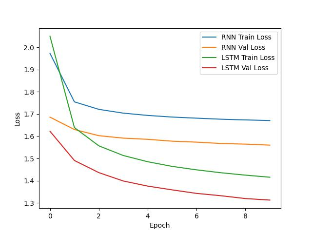
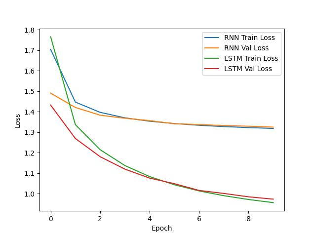

# Language-Modeling
Language-Modeling using RNN, LSTM models trained by "shakespeare_train.txt"
generating characters with our trained model.

# Assignment submitted by MinSeok Yoon
- Seoul National University of Science and Technology, Korea
- Department of Data Science
- Data-Driven User Analysis Lab
#### [Data-Driven User Analysis Lab] (https://ddua.seoultech.ac.kr/index.do)

# Assignment Reports
## **To run python files, please place the models in the "Models" folder in the same folder as the python file.
## Model Architecture Overview
- We used 2 vanilla RNN models and two LSTM models to compare model performance and conduct comparative experiments to see if applying performance enhancement techniques really worked.
- The structural differences between the first RNN, LSTM model and the second RNN, LSTM model are as follows.
  - num_layers : 2 => 3
  - Add Dropout Layer(=0.5) to prevent overfitting
    
### RNN Model 1 Summary

| Layer (type)    | Output Shape  | Param # |
|-----------------|---------------|---------|
| RNN-1           | [-1, 30, 128] | 20,480  |
| Linear-2        | [-1, 100, 65] | 8,385   |

**Total params:** 28,865  
**Trainable params:** 28,865  
**Non-trainable params:** 0  

### RNN Model 2 Summary

| Layer (type)    | Output Shape  | Param # |
|-----------------|---------------|---------|
| RNN-1           | [-1, 30, 128] | 25,344  |
| Linear-2        | [-1, 100, 65] | 8,385   |

**Total params:** 33,729  
**Trainable params:** 33,729  
**Non-trainable params:** 0  

### LSTM Model 1 Summary

| Layer (type)    | Output Shape  | Param # |
|-----------------|---------------|---------|
| LSTM-1          | [-1, 30, 128] | 99,840  |
| Linear-2        | [-1, 100, 65] | 8,385   |

**Total params:** 108,225  
**Trainable params:** 108,225  
**Non-trainable params:** 0  

### LSTM Model 2 Summary

| Layer (type)    | Output Shape  | Param # |
|-----------------|---------------|---------|
| LSTM-1          | [-1, 30, 128] | 131,584 |
| Linear-2        | [-1, 100, 65] | 8,385   |

**Total params:** 139,969  
**Trainable params:** 139,969  
**Non-trainable params:** 0 

## Experiments
### Hyperparameter
- Epochs = 10
- Batch size : 64
- hidden_size = 128
- Optimizer : AdamW
- Learning rate : 0.002
- Criterion = Cross Entropy Loss

### Average loss plot
- Average loss plot the average loss values for training and validation comparing RNN and LSTM
### Model RNN 1 & LSTM 1

- Analysis Model Performance
  - The RNN & LSTM model's training loss decreases steadily over the epochs, indicating that the model is learning from the training data.
  - The validation loss also decreases initially but The LSTM model's validation loss decreases more significantly and consistently compared to the RNN model, and it achieves lower validation loss values overall.

### Model RNN 2 & LSTM 2

- Analysis Model Performance
  - Certainly, we can see that the attempt to improve the model performance (dropout, more layers) reduced the model learning loss.
  - We can see that it starts with a much lower loss than the previous experiment (Model 1), but it doesn't decrease well with epoch. This can lead to overfitting if you go past more epoch.

### Generation Performance Analysis Report
- We need to provide at least 100 pieces of length of 5 different samples generated based on different seed characters.

